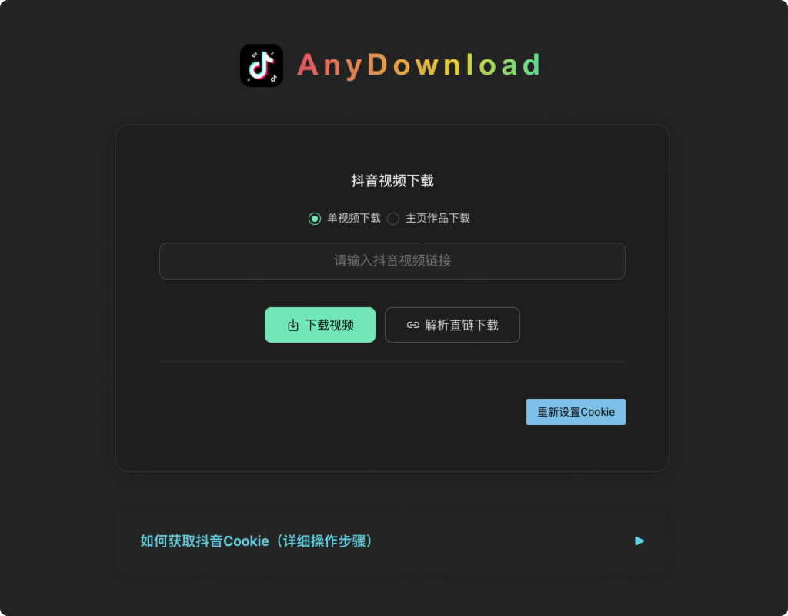

# AnyDownload 抖音视频下载平台

## 项目简介

AnyDownload 是一个开箱即用的抖音视频下载平台，支持单视频、主页作品批量下载、直链解析、Cookie配置、进度流式展示等功能。前端基于 Vue3 + Naive UI + Vite，后端基于Python f2包和FastAPI，支持一键 Docker 部署，适合个人收藏、内容备份、数据采集等多种场景。



## 项目特色

- 支持抖音单视频/主页作品批量下载
- 支持批量直链解析、无水印下载
- 支持 Cookie 配置与有效性自动检测
- 支持流式进度、错误提示、输入校验
- 前后端分离，UI美观，交互友好
- 一键部署，支持持久化与自定义配置

## 目录结构
```
项目根目录/
├── anydownload/           # 前端源码目录
│   ├── Dockerfile
│   ├── nginx.conf
│   └── ...
├── f2-container/          # 后端源码目录
│   ├── Dockerfile
│   ├── requirements.txt
│   ├── api_server.py
│   ├── app.yaml
│   └── ...
├── docker-compose-build.yml   # 源码构建部署
├── docker-compose.yml   # 镜像部署推荐
└── README.md
```

## 部署方式

### 方式一：推荐（使用官方镜像，最快速）

1. 启动所有服务（首次需联网拉取镜像）：
   ```bash
   docker-compose  up -d
   ```

2. 访问前端页面：
   - 浏览器打开 [http://localhost](http://localhost)

3. 访问后端API（如需）：
   - [http://localhost:8000/docs](http://localhost:8000/docs)  查看 FastAPI 文档

### 方式二：源码构建（如需自定义开发）

1. 构建并启动所有服务（首次需联网下载镜像，耐心等待）：
   ```bash
   docker-compose -f docker-compose-build.yml up --build -d
   ```

2. 访问方式同上。


## 使用方法

### 1. 抖音视频下载
- 在首页输入抖音视频链接，点击"解析并下载"即可获取无水印视频直链，支持下载。
- 支持批量输入主页链接，自动解析主页所有作品，批量展示下载直链。
- 下载进度实时展示，支持失败重试与错误提示。

### 2. Cookie 配置与检测
- 首次访问或 Cookie 失效时，系统会自动弹出 Cookie 配置窗口。
- 粘贴你的抖音 Cookie，点击保存，系统会自动检测有效性。
- Cookie 有效后可正常解析和下载，如需更换可随时点击"重新设置Cookie"。
- 输入框下方有灰色小字提示，支持文档折叠查看。

### 3. 常见交互流程
- 首次访问自动检测 Cookie，无效则引导配置。
- 主页批量解析时，支持分页、进度条、失败重试。
- 所有输入均有校验与友好错误提示。
- 下载目录与配置文件均可持久化，重启容器不会丢失。


## 常见问题

- **如何修改配置？**
  - 编辑 `f2-container/app.yaml`，重启容器即可生效。
- **如何持久化下载内容？**
  - 下载目录已通过卷挂载到 `f2-container/Download`，不会因容器重建丢失。
- **前端如何与后端联动？**
  - 已通过 nginx 代理 `/douyin/` 路径到后端，无需额外配置。
- **如何停止/重启服务？**
   ```bash
   docker-compose  stop   # 停止
   docker-compose  start  # 启动
   docker-compose  down   # 停止并移除容器
   ```

## 其他说明
- 如需更改端口，请同时修改 `docker-compose.yml` 和 `nginx.conf`。
- 如遇端口冲突，请先释放本地 80/8000 端口。
- 如需自定义构建参数，可修改各自的 Dockerfile。

---

如有问题请提交 issue 或联系开发者。 